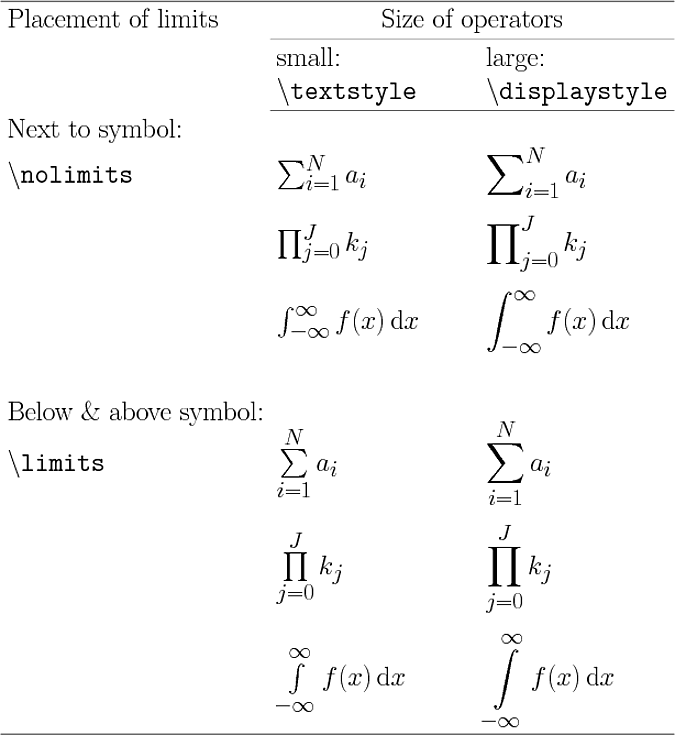

# MathJax LaTeX语法

## 希腊字母和希伯来字母

| latex     | display     | latex       | display       | latex     | display     |
| --------- | ----------- | ----------- | ------------- | --------- | ----------- |
| \alpha    | $\alpha$    |             |               |           |             |
| \beta     | $\beta$     |             |               |           |             |
| \gamma    | $\gamma$    | \Gamma      | $\Gamma$      | \digamma  | $\digamma$  |
| \delta    | $\delta$    | \Delta      | $\Delta$      |           |             |
| \epsilon  | $\epsilon$  | \varepsilon | $\varepsilon$ |           |             |
| \zeta     | $\zeta$     |             |               |           |             |
| \eta      | $\eta$      |             |               |           |             |
| \theta    | $\theta$    | \Theta      | $\Theta$      | \vartheta | $\vartheta$ |
| \iota     | $\iota$     |             |               |           |             |
| \kappa    | $\kappa$    | \varkappa   | $\varkappa$   |           |             |
| \lambda   | $\lambda$   | \Lambda     | $\Lambda$     |           |             |
| \mu       | $\mu$       | \nu         | $\nu$         |           |             |
| \xi       | $\xi$       | \Xi         | $\Xi$         |           |             |
| \pi       | $\pi$       | \Pi         | $\Pi$         | \varpi    | $\varpi$    |
| \rho      | $\rho$      | \varrho     | $\varrho$     |           |             |
| \sigma    | $\sigma$    | \Sigma      | $\Sigma$      | \varsigma | $\varsigma$ |
| \varsigma | $\varsigma$ | \tau        | $\tau$        |           |             |
| \upsilon  | $\upsilon$  | \Upsilon    | $\Upsilon$    |           |             |
| \phi      | $\phi$      | \Phi        | $\Phi$        | \varphi   | $\varphi$   |
| \chi      | $\chi$      |             |               |           |             |
| \psi      | $\psi$      | \Psi        | $\Psi$        |           |             |
| \omega    | $\omega$    | \Omega      | $\Omega$      |           |             |

## 逻辑运算符

| latex       | display       |
| ----------- | ------------- |
| \because    | $\because$    |
| \therefore  | $\therefore$  |
| \forall     | $\forall$     |
| \exists     | $\exists$     |
| \not=       | $\not=$       |
| \not>       | $\not>$       |
| \not\subset | $\not\subset$ |

## 集合运算符

| latex     | display     |
| --------- | ----------- |
| \emptyset | $\emptyset$ |
| \in       | $\in$       |
| \notin    | $\notin$    |
| \subset   | $\subset$   |
| \supset   | $\supset$   |
| \subseteq | $\subseteq$ |
| \supseteq | $\supseteq$ |
| \bigcap   | $\bigcap$   |
| \bigcup   | $\bigcup$   |
| \bigvee   | $\bigvee$   |
| \bigwedge | $\bigwedge$ |
| \biguplus | $\biguplus$ |
| \bigsqcup | $\bigsqcup$ |


## 箭头符号

### 常用箭头符号

| latex               | display               |
| ------------------- | --------------------- |
| \uparrow            | $\uparrow$            |
| \downarrow          | $\downarrow$          |
| \Uparrow            | $\Uparrow$            |
| \Downarrow          | $\Downarrow$          |
| \updownarrow        | $\updownarrow$        |
| \Updownarrow        | $\Updownarrow$        |
| \rightarrow         | $\rightarrow$         |
| \leftarrow          | $\leftarrow$          |
| \Rightarrow         | $\Rightarrow$         |
| \Leftarrow          | $\Leftarrow$          |
| \leftrightarrow     | $\leftrightarrow$     |
| \Leftrightarrow     | $\Leftrightarrow$     |
| \longrightarrow     | $\longrightarrow$     |
| \longleftarrow      | $\longleftarrow$      |
| \Longrightarrow     | $\Longrightarrow$     |
| \Longleftarrow      | $\Longleftarrow$      |
| \longleftrightarrow | $\longleftrightarrow$ |
| \Longleftrightarrow | $\Longleftrightarrow$ |

### 特殊箭头符号

| latex                | display                |
| -------------------- | ---------------------- |
| \mapsto              | $\mapsto$              |
| \longmapsto          | $\longmapsto$          |
| \hookleftarrow       | $\hookleftarrow$       |
| \hookrightarrow      | $\hookrightarrow$      |
| \leftharpoonup       | $\leftharpoonup$       |
| \rightharpoonup      | $\rightharpoonup$      |
| \leftharpoondown     | $\leftharpoondown$     |
| \rightharpoondown    | $\rightharpoondown$    |
| \rightleftharpoons   | $\rightleftharpoons$   |
| \leadsto             | $\leadsto$             |
| \nearrow             | $\nearrow$             |
| \searrow             | $\searrow$             |
| \swarrow             | $\swarrow$             |
| \nwarrow             | $\nwarrow$             |
| \nleftarrow          | $\nleftarrow$          |
| \nrightarrow         | $\nrightarrow$         |
| \nLeftarrow          | $\nLeftarrow$          |
| \nRightarrow         | $\nRightarrow$         |
| \nleftrightarrow     | $\nleftrightarrow$     |
| \nLeftrightarrow     | $\nLeftrightarrow$     |
| \dashrightarrow      | $\dashrightarrow$      |
| \dashleftarrow       | $\dashleftarrow$       |
| \leftleftarrows      | $\leftleftarrows$      |
| \leftrightarrows     | $\leftrightarrows$     |
| \Lleftarrow          | $\Lleftarrow$          |
| \twoheadleftarrow    | $\twoheadleftarrow$    |
| \leftarrowtail       | $\leftarrowtail$       |
| \looparrowleft       | $\looparrowleft$       |
| \leftrightharpoons   | $\leftrightharpoons$   |
| \curvearrowleft      | $\curvearrowleft$      |
| \circlearrowleft     | $\circlearrowleft$     |
| \Lsh                 | $\Lsh$                 |
| \upuparrows          | $\upuparrows$          |
| \upharpoonleft       | $\upharpoonleft$       |
| \downharpoonleft     | $\downharpoonleft$     |
| \multimap            | $\multimap$            |
| \leftrightsquigarrow | $\leftrightsquigarrow$ |
| \rightrightarrows    | $\rightrightarrows$    |
| \rightleftarrows     | $\rightleftarrows$     |
| \rightrightarrows    | $\rightrightarrows$    |
| \rightleftarrows     | $\rightleftarrows$     |
| \twoheadrightarrow   | $\twoheadrightarrow$   |
| \rightarrowtail      | $\rightarrowtail$      |
| \looparrowright      | $\looparrowright$      |
| \rightleftharpoons   | $\rightleftharpoons$   |
| \curvearrowright     | $\curvearrowright$     |
| \circlearrowright    | $\circlearrowright$    |
| \Rsh                 | $\Rsh$                 |
| \downdownarrows      | $\downdownarrows$      |
| \upharpoonright      | $\upharpoonright$      |
| \downharpoonright    | $\downharpoonright$    |
| \rightsquigarrow     | $\rightsquigarrow$     |

## 关系运算符

| latex      | display      |
| ---------- | ------------ |
| \mid       | $\mid$       |
| \nmid      | $\nmid$      |
| \cdot      | $\cdot$      |
| \leq       | $\leq$       |
| \geq       | $\geq$       |
| \neq       | $\neq$       |
| \approx    | $\approx$    |
| \equiv     | $\equiv$     |
| \circ      | $\circ$      |
| \ast       | $\ast$       |
| \bigodot   | $\bigodot$   |
| \bigotimes | $\bigotimes$ |
| \bigoplus  | $\bigoplus$  |

## 其他运算符

| latex   | display   |
| ------- | --------- |
| \pm     | $\pm$     |
| \times  | $\times$  |
| \div    | $\div$    |
| \sum    | $\sum$    |
| \prod   | $\prod$   |
| \coprod | $\coprod$ |

## 字母修饰

### 上下标

| latex | display |
| ----- | ------- |
| x^2   | $x^2$   |
| x_i   | $x_i$   |

### 矢量

| latex               | display               |
| ------------------- | --------------------- |
| \vec a              | $\vec a$              |
| \overrightarrow{xy} | $\overrightarrow{xy}$ |


## 分组

使用大括号 {} 将具有相同等级的内容扩入其中，成组处理

| latex             | display             |
| ----------------- | ------------------- |
| 10^{x+1}          | $10^{x+1}$          |
| \frac{x}{N_i+x^2} | $\frac{x}{N_i+x^2}$ |

## 括号

| latex                    | display                    |
| ------------------------ | -------------------------- |
| (,)                      | $(,)$                      |
| [,]                      | $[,]$                      |
| \langle,\rangle          | $\langle,\rangle$          |
| \left(\frac{x}{y}\right) | $\left(\frac{x}{y}\right)$ |


## 求和、极限与积分


| Func | latex               | display               |
| ---- | ------------------- | --------------------- |
| 求和   | \sum_{i=1}^n{a_i}   | $\sum_{i=1}^n{a_i}$   |
| 极限   | \lim_{x\to 0}       | $\lim_{x \to 0}$      |
| 积分   | \int_0^\infty{fxdx} | $\int_0^\infty{fxdx}$ |

## 分式与根式


| Func | latex         | display         |
| ---- | ------------- | --------------- |
| 分式   | \frac{1}{N+1} | $\frac{1}{N+1}$ |
| 根式   | \sqrt[x]{y}   | $\sqrt[x]{y}$   |

## 特殊函数

使用 **\函数名** 来实现特殊函数

| latex                    | display                    |
| ------------------------ | -------------------------- |
| \sin x，\ln x，\max(A,B,C) | $\sin x,\ln x,\max(A,B,C)$ |

## 特殊符号

| latex       | display       |
| ----------- | ------------- |
| \infty      | $\infty$      |
| \cup        | $\cup$        |
| \cap        | $\cap$        |
| \subset     | $\subset$     |
| \subseteq   | $\subseteq$   |
| \supset     | $\supset$     |
| \in         | $\in$         |
| \notin      | $\notin$      |
| \varnothing | $\varnothing$ |
| \forall     | $\forall$     |
| \exists     | $\exists$     |
| \lnot       | $\lnot$       |
| \nabla      | $\nabla$      |
| \partial    | $\partial$    |

## 矩阵

起始标记 ``\begin{matrix}`` ，结束标记 ``\end{matrix}``

每一行末尾标记``\\``，行间元素之间以``&``分隔

```
$$\begin{matrix}
1&0&0\\
0&1&0\\
0&0&1\\
\end{matrix}$$
```

显示：

$$
\begin{matrix}1&0&0\\0&1&0\\0&0&1\\\end{matrix}
$$


### 矩阵边框

在起始、结束标记处用下列词替换``{matrix}``

| latex     | desc  |
| --------- | ----- |
| {pmatrix} | 小括号边框 |
| {bmatrix} | 中括号边框 |
| {Bmatrix} | 大括号边框 |
| {vmatrix} | 单竖线边框 |
| {Vmatrix} | 双竖线边框 |

$$
\begin{bmatrix}1&0&0\\0&1&0\\0&0&1\\\end{bmatrix}
$$


## 省略元素

| latex  | desc |
| ------ | ---- |
| \cdots | 横省略号 |
| \vdots | 竖省略号 |
| \ddots | 斜省略号 |

```
$$\begin{bmatrix}
{a_{11}}&{a_{12}}&{\cdots}&{a_{1n}}\\
{a_{21}}&{a_{22}}&{\cdots}&{a_{2n}}\\
{\vdots}&{\vdots}&{\ddots}&{\vdots}\\
{a_{m1}}&{a_{m2}}&{\cdots}&{a_{mn}}\\
\end{bmatrix}$$
```

显示：


$$
\begin{bmatrix}{a_{11}}&{a_{12}}&{\cdots}&{a_{1n}}\\{a_{21}}&{a_{22}}&{\cdots}&{a_{2n}}\\{\vdots}&{\vdots}&{\ddots}&{\vdots}\\{a_{m1}}&{a_{m2}}&{\cdots}&{a_{mn}}\\\end{bmatrix}
$$

## 阵列

- 需要array环境：起始、结束处以``{array}``声明
- 对齐方式：在``{array}``后以``{}``逐行统一声明
- 左对齐：l；居中：c；右对齐：r
- 竖直线：在声明对齐方式时，插入|建立竖直线
- 插入水平线：\hline

```
$$\begin{array}{c|lll}
{↓}&{a}&{b}&{c}\\
\hline
{R_1}&{c}&{b}&{a}\\
{R_2}&{b}&{c}&{c}\\
\end{array}$$
```

显示：

$$
\begin{array}{c|lll}{↓}&{a}&{b}&{c}\\\hline{R_1}&{c}&{b}&{a}\\{R_2}&{b}&{c}&{c}\\\end{array}
$$


## 方程组
```
$$\begin{cases}
a_1x+b_1y+c_1z=d_1\\
a_2x+b_2y+c_2z=d_2\\
a_3x+b_3y+c_3z=d_3\\
\end{cases}
$$
```

显示：

$$
\begin{cases}a_1x+b_1y+c_1z=d_1\\a_2x+b_2y+c_2z=d_2\\a_3x+b_3y+c_3z=d_3\\\end{cases}
$$


## 分段函数

右侧文本

```
$$
f(n) =
\begin{cases}
n/2,  & \text{if $n$ is even} \\
3n+1, & \text{if $n$ is odd}
\end{cases}
$$
```

显示：

$$
f(n) =
\begin{cases}
n/2,  & \text{if $n$ is even} \\
3n+1, & \text{if $n$ is odd}
\end{cases}
$$

## 颜色

$$
\begin{array}{|rc|}
\hline
\verb+\color{black}{text}+ & \color{black}{text} \\
\verb+\color{gray}{text}+ & \color{gray}{text} \\
\verb+\color{silver}{text}+ & \color{silver}{text} \\
\verb+\color{white}{text}+ & \color{white}{text} \\
\hline
\verb+\color{maroon}{text}+ & \color{maroon}{text} \\
\verb+\color{red}{text}+ & \color{red}{text} \\
\verb+\color{yellow}{text}+ & \color{yellow}{text} \\
\verb+\color{lime}{text}+ & \color{lime}{text} \\
\verb+\color{olive}{text}+ & \color{olive}{text} \\
\verb+\color{green}{text}+ & \color{green}{text} \\
\verb+\color{teal}{text}+ & \color{teal}{text} \\
\verb+\color{aqua}{text}+ & \color{aqua}{text} \\
\verb+\color{blue}{text}+ & \color{blue}{text} \\
\verb+\color{navy}{text}+ & \color{navy}{text} \\
\verb+\color{purple}{text}+ & \color{purple}{text} \\ 
\verb+\color{fuchsia}{text}+ & \color{magenta}{text} \\
\hline
\end{array}
$$

$$
\begin{array}{|rrrrrrrr|}
\hline
\verb+#000+ & \color{#000}{text} & \verb+#005+ & \color{#005}{text} & \verb+#00A+ & \color{#00A}{text} & \verb+#00F+ & \color{#00F}{text}  \\
\verb+#500+ & \color{#500}{text} & \verb+#505+ & \color{#505}{text} & \verb+#50A+ & \color{#50A}{text} & \verb+#50F+ & \color{#50F}{text}  \\
\verb+#A00+ & \color{#A00}{text} & \verb+#A05+ & \color{#A05}{text} & \verb+#A0A+ & \color{#A0A}{text} & \verb+#A0F+ & \color{#A0F}{text}  \\
\verb+#F00+ & \color{#F00}{text} & \verb+#F05+ & \color{#F05}{text} & \verb+#F0A+ & \color{#F0A}{text} & \verb+#F0F+ & \color{#F0F}{text}  \\
\hline
\verb+#080+ & \color{#080}{text} & \verb+#085+ & \color{#085}{text} & \verb+#08A+ & \color{#08A}{text} & \verb+#08F+ & \color{#08F}{text}  \\
\verb+#580+ & \color{#580}{text} & \verb+#585+ & \color{#585}{text} & \verb+#58A+ & \color{#58A}{text} & \verb+#58F+ & \color{#58F}{text}  \\
\verb+#A80+ & \color{#A80}{text} & \verb+#A85+ & \color{#A85}{text} & \verb+#A8A+ & \color{#A8A}{text} & \verb+#A8F+ & \color{#A8F}{text}  \\
\verb+#F80+ & \color{#F80}{text} & \verb+#F85+ & \color{#F85}{text} & \verb+#F8A+ & \color{#F8A}{text} & \verb+#F8F+ & \color{#F8F}{text}  \\
\hline
\verb+#0F0+ & \color{#0F0}{text} & \verb+#0F5+ & \color{#0F5}{text} & \verb+#0FA+ & \color{#0FA}{text} & \verb+#0FF+ & \color{#0FF}{text}  \\
\verb+#5F0+ & \color{#5F0}{text} & \verb+#5F5+ & \color{#5F5}{text} & \verb+#5FA+ & \color{#5FA}{text} & \verb+#5FF+ & \color{#5FF}{text}  \\
\verb+#AF0+ & \color{#AF0}{text} & \verb+#AF5+ & \color{#AF5}{text} & \verb+#AFA+ & \color{#AFA}{text} & \verb+#AFF+ & \color{#AFF}{text}  \\
\verb+#FF0+ & \color{#FF0}{text} & \verb+#FF5+ & \color{#FF5}{text} & \verb+#FFA+ & \color{#FFA}{text} & \verb+#FFF+ & \color{#FFF}{text}  \\
\hline
\end{array}
$$

## 其他



