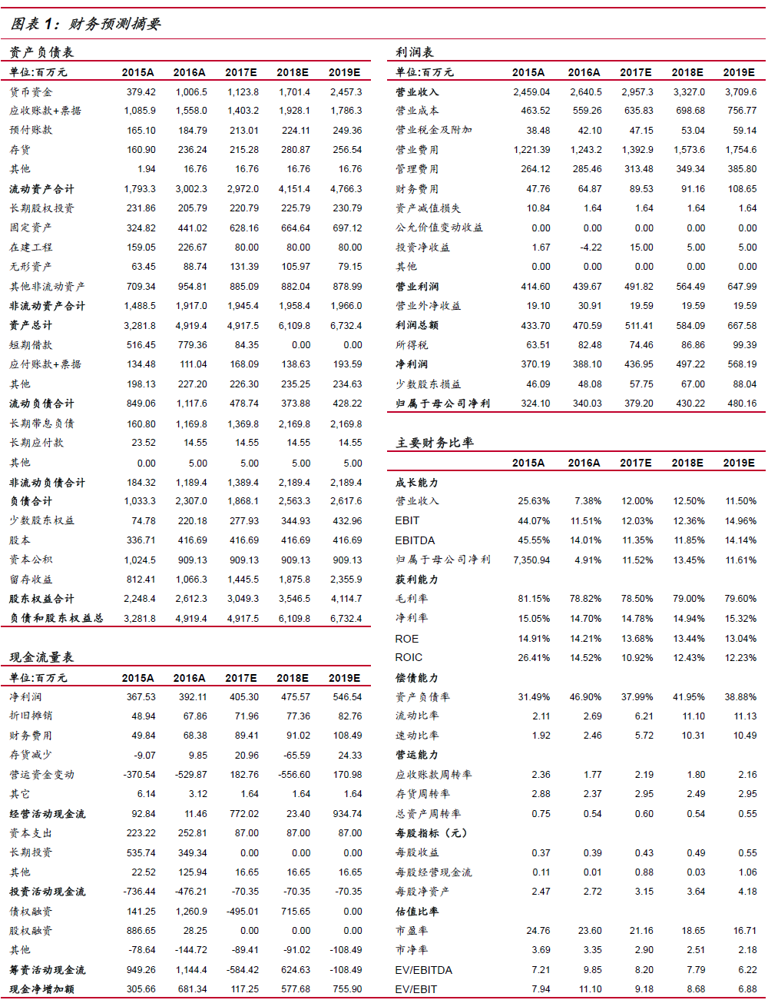

# 景峰医药（000908）基本面概览

### 主营品种

#### 参芎葡萄糖

- 2016 年预计收入12 亿，占比公司营收近46%；
- 2017 年总共有27 个省份的地方医保，较16 年增加2 个；
- 福建有望重新谈判进入，预计2017 年同比增长10%左右。

#### 玻璃酸钠([链接](玻璃酸钠.md))

- 市场占有率第一；
- 2016 年营收预计3 亿左右；
- 2017 年公司逐渐提高该品种的自营比率，预计增速10%左右。

#### 榄香烯([链接](榄香烯.md))

- 公司共有17 个品种在2017 版医保目录中，其中新进及增加适应症4 个：全國獨家品種欖香烯注射液(乙類)及欖香烯口服乳( 乙類) 、全國獨家品種鎮痛活絡酊( 乙類) 、培美曲塞( 乙類) ；
- 榄香烯唯一竞争者为石药，其为普通水针，销售额16 年预计过亿；
  - 公司有两个剂型，且都为脂质体，具有通过血脑屏障的优势；
  - 2009 版医保仅纳入癌性胸腹水适应症；
  - 2009-2016 年公司逐步获得14 个省份的7 个适应症解限；
  - 2017 版全国医保共纳入6 个适应症；
- 2016 年预计营收4 个亿，全国医保适应症扩大的利好叠加，预计三年过10 亿。
- 公司二线品种形成以榄香烯为龙头的肿瘤用药产品线群，2018 年预计营收超过参芎
  葡萄糖，促进估值提升。

#### 镇痛活络酊

- 2016 年预计销售2 亿左右，目前处于成长期，17 年预计增长20%。

### 财务预测摘要

